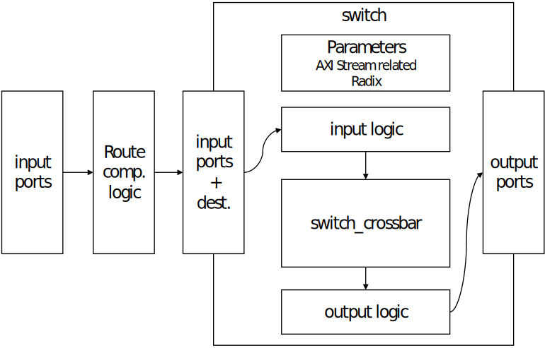

# Ethernet Switch Readme

## Introduction

Github repository: https://github.com/corundum/ethernet-switch

This repository is a collection of code for the implementation of a FPGA-based Ethernet switch written in Verilog. 

The main idea is to collect different pieces of code to generate different switching architectures for the conmutation of Ethernet frames. These architectures follow this diagram from the input ports to the output ports:



It is currently in the prototyping phase and includes code for the following architectures:

* Input Queued (IQ): all files related to it end with *_iq (e.g. switch_iq.v or switch_crossbar_iq.v)
* Input Queued with Virtual Output Queueing (IQ with VOQ): all files related to it end with *_iq_voq (e.g. switch_iq_voq.v or switch_crossbar_iq_voq.v)
* Output Queued (OQ): all files related to it end with *_oq (e.g. switch_oq.v or switch_crossbar_oq.v)

The most "advanced" design for the switch does not use suffixes for its files and folders (e.g. switch.v or switch_crossbar.v): currently corresponds to IQ with VOQ

None of the current switch designs support broadcasting.

All the architectures provided with test files and can be evaluated by the provided benchmarking tool.

## Tests
Tests associated to each implementation can be run by setting up a virtual environment using **poetry** and the given poetry.lock and pyproject.toml files in the corresponding directory.

Just run `poetry shell` and then `poetry install` inside the test folder of the switch architecture to get it ready. Then, you can run `make` or `make WAVES=1` to launch the tests.

## Benchmark
A command line interface (CLI) written in Python, called **switchbench**, is provided to launch benchmark tests for the different switch architectures. 

The tool provides two commands:
* **traffic**: generates a traffic pattern based on the individual configuration of frames defined by: input (arrival) port, output (destination) port and size in bytes. The size of the frames define in the pattern can be the same for each one or taken from a 
uniform distribution within a specified range. This is indicated using the different options of the command. The traffic patern obtained is stored in a .txt (.csv format).

* **latency**: launches a latency benchmark for a given switch architecture using a traffic pattern. Options such as the radix of the switch or the width of the data bus can be configured. The results of the benchmark are stored in another file for further processing.

The main purpose of this benchmark is to test the performance for the different switch architectures implemented and compare them against each other.

To start trying out the benchrmarking tool just run `poetry shell` and then `poetry install` inside the benchmark folder to get the environment set. Then generate a traffic pattern using the **traffic** command and finally run the **latency** command to get the latency measurement for each frame of the traffic pattern.

Example sequence of commands to run inside /benchmark:

```
python switchbench.py traffic uniform -r 8 -n 10 -l 80 -u 120 
python switchbench.py latency iq -r 8 -d 64 -f "uniform-8x8-10-(80-120)"
```
The traffic pattern consists of sending 10 frames with size taken from an uniform distribution in the range [80, 120] bytes for each one of the 8 ports; output file: uniform-8x8-10-(80-120) located in benchmark/traffic/profiles.

The latency benchmark is launched using the previous traffic pattern for the IQ switch architecture with 64 bits of bus data width; output file: iq-64-uniform-8x8-10-(80-120) located in benchmark/latency/results.

## Documentation

### `switch`

Wrapper of the switch. Includes the switch crossbar logic and other input and output logic. The tdest signal of AXI-Stream interface is used to handle the destination port of an incoming frame.

### `switch_crossbar`

Main logic of the implementation connecting the input and output ports.

### `switch_iq`

Wrapper of the IQ switch. It includes the switch crossbar logic and input FIFOs. The tdest signal of AXI-Stream interface is used to handle the destination port of an incoming frame.
* input logic: one synchronous FIFO per input port.
* output logic: none.

### `switch_crossbar_iq`

Main logic of the IQ switch implementation connecting the input and output ports. One arbiter is instantiated for each output port to handle the input-output wiring.

### `switch_iq_voq`

Wrapper of the IQ with VOQ switch. It includes the switch crossbar logic and VOQ FIFOs. The tdest signal of AXI-Stream interface is used to handle the destination port of an incoming frame.
* input logic: as much synchronous FIFOs as the number of output ports, per input port.
* output logic: none.

### `switch_crossbar_iq_voq`

Main logic of the IQ with VOQ switch implementation connecting the VOQ FIFOs and output ports. One arbiter is instantiated for each output port to handle the input-output wiring.

### `switch_oq`

Wrapper of the OQ switch. It includes one input FIFO in frame mode per input port, the switch crossbar logic and the output FIFOs. The tdest signal of AXI-Stream interface is used to handle the destination port of an incoming frame.
* input logic: one aynchronous FIFO in frame mode per output port.
* output logic: one aynchronous FIFO per output port.

### `switch_crossbar_oq`

Main logic of the OQ switch implementation connecting the input FIFOs in frame mode to the output FIFOs. One arbiter is instantiated for each output port to handle the input-output wiring.